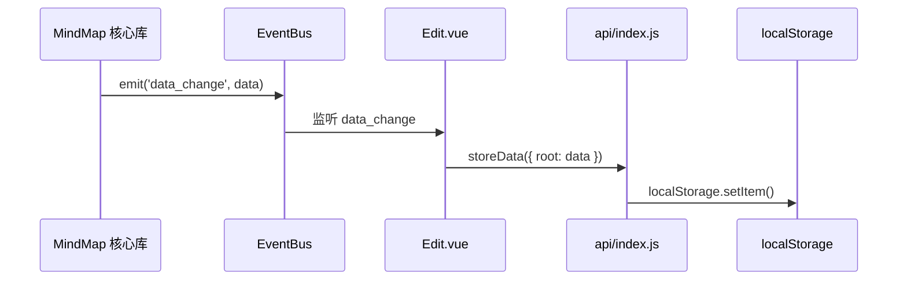
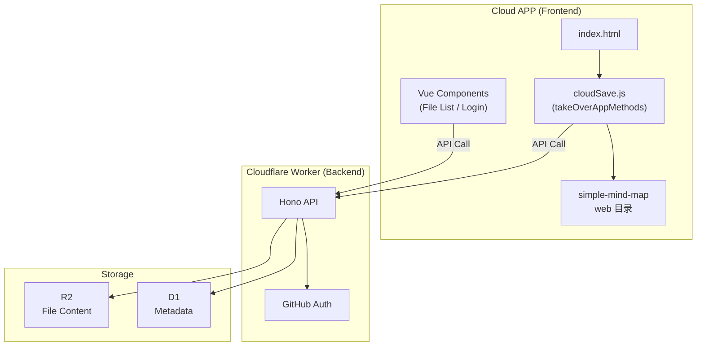

# 云端保存功能技术方案分析

版本: 1.1.0
更新时间: 2026-01-08 22:31:37

---

## 1. 背景与约束

### 1.1 关键需求
- 将思维导图数据保存到云端（R2）而非本地
- 支持自动保存（每 30 秒）和手动保存
- 屏蔽本地保存功能
- **文件列表与管理**：用户登录后进入文件列表，支持新建、重命名、删除、分享
- **分享功能**：基于 UUID 生成分享链接，分享页为只读模式

### 1.2 关键约束
- **不修改原 `simple-mind-map` 源码**，以便后续无缝升级
- 部署于 Cloudflare Workers，使用 R2 存储、D1 数据库
- 前端采用 takeOverApp 接管模式

---

## 2. 现有保存机制分析

### 2.1 数据流向



### 2.2 保存触发点

| 触发方式 | 触发位置 | 调用方法 |
|----------|----------|----------|
| 数据变更自动保存 | `Edit.vue` L317-318 | `storeData({ root: data })` |
| 视图变更自动保存 | `Edit.vue` L320-327 | `storeData({ view: data })` |
| 手动保存 (Ctrl+S) | `Edit.vue` L450-452 | `manualSave()` → `storeData()` |
| 导入数据后保存 | `Edit.vue` L530 | `manualSave()` |

---

## 3. 技术方案对比

| 维度 | 方案一 (takeOverApp) | 方案二 (替换 api) | 方案三 (事件劫持) |
|------|---------------------|------------------|------------------|
| 侵入性 | 零侵入 | 需修改文件 | 零侵入 |
| 可维护性 | 高 | 低 | 中 |
| 官方支持 | 是 | 否 | 否 |
| 实现复杂度 | 中 | 低 | 低 |
| 推荐度 | **推荐** | 不推荐 | 可选 |

**结论：采用方案一（takeOverApp 接管模式）**

---

## 4. 详细实施方案

### 4.1 整体架构



### 4.2 前端实现

#### 4.2.1 目录结构
新增 `cloud-app` 目录，作为新的前端项目入口，复用 `web` 目录的构建产物。

```
mind-map/
├── cloud-app/
│   ├── public/
│   │   ├── index.html      # 云端版主入口
│   │   └── cloudSave.js    # 接管脚本
│   └── src/
│       └── api/
│           └── cloudApi.js # API 封装
```

#### 4.2.2 `cloudSave.js` 接管逻辑
实现 `window.takeOverAppMethods` 接口：

```javascript
window.takeOverApp = true
window.takeOverAppMethods = {
  // 从云端/URL参数加载数据
  async getMindMapData() {
     const fileId = getFileIdFromUrl()
     if (fileId) {
       return await api.getFileContent(fileId)
     }
     return getDefaultData()
  },
  
  // 防抖保存到云端
  saveMindMapData: debounce(async (data) => {
     const fileId = getFileIdFromUrl()
     if (fileId) {
       await api.updateFileContent(fileId, data)
     } else {
       // 新建文件逻辑
     }
  }, 1000),
  
  // 其他配置接口维持 localStorage 或同步到云端
  getMindMapConfig: () => localStorage.getItem('SIMPLE_MIND_MAP_CONFIG'),
  saveMindMapConfig: (config) => localStorage.setItem('SIMPLE_MIND_MAP_CONFIG', config),
  // ...
}
```

#### 4.2.3 `index.html` 改造
基于原 `index.html`，引入 `cloudSave.js`，并添加 UI 状态反馈（如保存中、已保存）。

### 4.3 后端实现 (Cloudflare Worker)

#### 4.3.1 技术选型
- **Runtime**: Cloudflare Workers
- **Framework**: Hono (轻量级 Web 框架)
- **Database**: D1 (SQLite)
- **Storage**: R2 (Object Storage)

#### 4.3.2 数据库设计 (D1)

**Users 表**
```sql
CREATE TABLE users (
  id TEXT PRIMARY KEY,
  github_id TEXT UNIQUE NOT NULL,
  username TEXT NOT NULL,
  avatar_url TEXT,
  email TEXT,
  created_at DATETIMEDEFAULT CURRENT_TIMESTAMP,
  updated_at DATETIME DEFAULT CURRENT_TIMESTAMP
);
```

**Files 表**
```sql
CREATE TABLE files (
  id TEXT PRIMARY KEY,
  user_id TEXT NOT NULL,
  name TEXT NOT NULL,
  size INTEGER DEFAULT 0,
  r2_key TEXT NOT NULL,
  thumbnail_key TEXT,
  is_shared INTEGER DEFAULT 0,
  created_at DATETIME DEFAULT CURRENT_TIMESTAMP,
  updated_at DATETIME DEFAULT CURRENT_TIMESTAMP,
  FOREIGN KEY (user_id) REFERENCES users(id)
);
```

#### 4.3.3 API 接口设计

| 方法 | 路径 | 功能 |
|------|------|------|
| **Auth** | | |
| GET | `/api/auth/github` | 跳转 GitHub 授权 |
| GET | `/api/auth/callback` | OAuth 回调，颁发 JWT |
| POST | `/api/auth/logout` | 登出 |
| GET | `/api/auth/me` | 当前用户信息 |
| **Files** | | |
| GET | `/api/files` | 文件列表 |
| POST | `/api/files` | 创建文件 |
| GET | `/api/files/:id` | 获取文件详情 |
| PUT | `/api/files/:id` | 重命名/更新信息 |
| DELETE | `/api/files/:id` | 删除文件 |
| **Content** | | |
| GET | `/api/files/:id/content` | 获取 R2 内容 |
| PUT | `/api/files/:id/content` | 写入 R2 内容 |
| **Share** | | |
| PUT | `/api/files/:id/share` | 开启/关闭分享 |
| GET | `/api/share/:id/content` | 公开获取内容（无需 Token） |

---

## 5. 验证计划

### 5.1 本地开发验证
1. **takeOverApp 机制验证**：在本地 修改 index.html，验证 `window.takeOverApp = true` 后 localStorage 是否停止写入。
2. **Mock API 验证**：前端对接 Mock 数据，验证列表页、编辑页流程。

### 5.2 Worker 接口验证
1. 使用 `wrangler dev` 启动本地 Worker。
2. 使用 `curl` 或 Postman 测试 Auth、User、File 等接口。

### 5.3 集成测试
1. 部署 Worker 到 Cloudflare。
2. 配置真实 GitHub App Client ID/Secret。
3. 完整跑通：登录 -> 列表 -> 新建 -> 编辑 -> 自动保存 -> 分享。

---

## 变更历史

| 版本 | 时间 | 变更内容 |
|------|------|----------|
| 1.1.0 | 2026-01-08 22:31:37 | 整合 detailed implementation plan |
| 1.0.0 | 2026-01-08 22:18:03 | 初始版本 |
