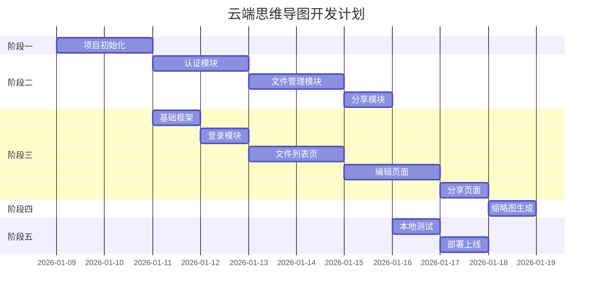

# 云端思维导图开发计划

版本: 1.0.0
更新时间: 2026-01-08 22:37:25

---

## 概述

为 `simple-mind-map` 项目增加登录、云端存储、展示、分享功能。采用 **Cloudflare Workers + R2 + D1** 技术栈，通过 **takeOverApp 接管模式** 实现云端保存，保持与原项目的解耦。

---

## 开发阶段规划

### 阶段一：项目初始化（预计 2 天）

| 任务 | 描述 | 产出 |
|------|------|------|
| 1.1 创建 cloud-app 目录结构 | 新建前端项目目录，配置构建工具 | `cloud-app/` 目录结构 |
| 1.2 创建 worker 目录结构 | 新建后端 Worker 项目 | `worker/` 目录结构 |
| 1.3 配置 wrangler | 配置 Cloudflare Workers 开发环境 | `wrangler.toml` |
| 1.4 初始化 D1 数据库 | 创建 users 和 files 表 | 数据库 Schema |

#### 目录结构

```
mind-map/
├── cloud-app/                    # 新增：云端版前端
│   ├── public/
│   │   ├── index.html           # 云端版入口
│   │   └── assets/
│   ├── src/
│   │   ├── api/                 # API 封装
│   │   ├── components/          # 页面组件
│   │   ├── router/              # 路由配置
│   │   ├── store/               # 状态管理
│   │   ├── utils/               # 工具函数
│   │   └── App.vue
│   ├── package.json
│   └── vite.config.js
├── worker/                       # 新增：Cloudflare Worker 后端
│   ├── src/
│   │   ├── index.ts             # 入口
│   │   ├── routes/              # 路由
│   │   ├── middleware/          # 中间件
│   │   ├── services/            # 业务逻辑
│   │   └── types/               # 类型定义
│   ├── wrangler.toml
│   └── package.json
├── simple-mind-map/              # 核心库（不修改）
├── web/                          # 原 Demo 应用（不修改）
└── 需求/                          # 需求文档
```

---

### 阶段二：后端 API 开发（预计 5 天）

#### 2.1 认证模块（2 天）

| 任务 | API | 描述 |
|------|-----|------|
| 2.1.1 GitHub OAuth 发起 | `GET /api/auth/github` | 重定向到 GitHub 授权页 |
| 2.1.2 OAuth 回调 | `GET /api/auth/callback` | 验证并颁发 JWT |
| 2.1.3 获取用户信息 | `GET /api/auth/me` | 返回当前登录用户信息 |
| 2.1.4 退出登录 | `POST /api/auth/logout` | 清除登录状态 |
| 2.1.5 JWT 中间件 | - | 验证请求 Token |

#### 2.2 文件管理模块（2 天）

| 任务 | API | 描述 |
|------|-----|------|
| 2.2.1 文件列表 | `GET /api/files` | 获取用户文件列表 |
| 2.2.2 创建文件 | `POST /api/files` | 创建新文件记录 |
| 2.2.3 获取文件详情 | `GET /api/files/:id` | 获取单个文件元信息 |
| 2.2.4 更新文件信息 | `PUT /api/files/:id` | 重命名等 |
| 2.2.5 删除文件 | `DELETE /api/files/:id` | 删除文件及 R2 资源 |
| 2.2.6 获取文件内容 | `GET /api/files/:id/content` | 从 R2 获取内容 |
| 2.2.7 保存文件内容 | `PUT /api/files/:id/content` | 写入 R2 |

#### 2.3 分享模块（1 天）

| 任务 | API | 描述 |
|------|-----|------|
| 2.3.1 切换分享状态 | `PUT /api/files/:id/share` | 开启/关闭分享 |
| 2.3.2 获取分享内容 | `GET /api/share/:id/content` | 公开访问（无需认证） |

---

### 阶段三：前端页面开发（预计 5 天）

#### 3.1 基础框架（1 天）

| 任务 | 描述 |
|------|------|
| 3.1.1 Vite + Vue 3 项目搭建 | 初始化前端项目 |
| 3.1.2 路由配置 | 配置登录、列表、编辑、分享页路由 |
| 3.1.3 API 封装 | 封装 axios，添加 JWT 拦截器 |
| 3.1.4 UI 框架集成 | Element Plus 或自定义样式 |

#### 3.2 登录模块（0.5 天）

| 任务 | 描述 |
|------|------|
| 3.2.1 登录页面 | GitHub OAuth 登录入口 |
| 3.2.2 登录回调处理 | 保存 Token，跳转列表页 |

#### 3.3 文件列表页（1.5 天）

| 任务 | 描述 |
|------|------|
| 3.3.1 文件卡片组件 | 显示缩略图、名称、时间、大小 |
| 3.3.2 创建新文件卡片 | 固定在首位的创建入口 |
| 3.3.3 卡片操作菜单 | 重命名、删除、分享开关、复制链接 |
| 3.3.4 搜索与排序 | 按名称搜索，按时间排序 |
| 3.3.5 文件上传 | 上传 .smm / .json 文件 |
| 3.3.6 空状态提示 | 无文件时的引导 UI |

#### 3.4 编辑页面（1.5 天）

| 任务 | 描述 |
|------|------|
| 3.4.1 takeOverApp 接管实现 | 实现 `window.takeOverAppMethods` |
| 3.4.2 云端数据加载 | 从 API 加载文件内容 |
| 3.4.3 云端保存 | 防抖自动保存 + 手动保存 |
| 3.4.4 保存状态提示 | 显示"保存中..."、"已保存" |
| 3.4.5 返回列表导航 | 离开提示未保存内容 |
| 3.4.6 新建文件流程 | 首次保存时输入文件名 |

#### 3.5 分享页面（0.5 天）

| 任务 | 描述 |
|------|------|
| 3.5.1 只读展示 | 裁剪 simple-mind-map 编辑功能 |
| 3.5.2 保留交互 | 缩放、平移、折叠/展开 |
| 3.5.3 下载功能 | 下载 .smm 文件 |
| 3.5.4 分享无效提示 | 404 / 分享已关闭页面 |

---

### 阶段四：缩略图生成（预计 1 天）

| 任务 | 描述 |
|------|------|
| 4.1 前端生成方案 | 使用 Export 插件生成 PNG |
| 4.2 尺寸处理 | 裁剪/缩放到 300x200 |
| 4.3 上传存储 | 保存时同步上传缩略图到 R2 |

---

### 阶段五：测试与部署（预计 2 天）

#### 5.1 本地测试（1 天）

| 任务 | 描述 |
|------|------|
| 5.1.1 Worker 本地测试 | 使用 `wrangler dev` 测试 API |
| 5.1.2 前端联调 | 前后端本地联调 |
| 5.1.3 功能走查 | 完整流程测试 |

#### 5.2 部署上线（1 天）

| 任务 | 描述 |
|------|------|
| 5.2.1 配置 GitHub App | 创建 OAuth App，获取 Client ID/Secret |
| 5.2.2 配置环境变量 | JWT_SECRET、GITHUB_CLIENT_ID 等 |
| 5.2.3 部署 Worker | `wrangler deploy` |
| 5.2.4 配置域名 | 绑定自定义域名 |
| 5.2.5 验收测试 | 线上环境完整测试 |

---

## 技术实现要点

### takeOverApp 接管实现

```javascript
window.takeOverApp = true
window.takeOverAppMethods = {
  // 加载思维导图数据
  async getMindMapData() {
    const fileId = getFileIdFromUrl()
    if (fileId) {
      const res = await api.getFileContent(fileId)
      return res.data
    }
    return getDefaultData()
  },
  
  // 保存思维导图数据（防抖）
  saveMindMapData: debounce(async (data) => {
    const fileId = getFileIdFromUrl()
    if (fileId) {
      await api.updateFileContent(fileId, data)
      showSaveStatus('已保存')
    }
  }, 1000),
  
  // 配置存储保持 localStorage
  getMindMapConfig: () => localStorage.getItem('SIMPLE_MIND_MAP_CONFIG'),
  saveMindMapConfig: (config) => localStorage.setItem('SIMPLE_MIND_MAP_CONFIG', config)
}
```

### D1 数据库 Schema

```sql
-- 用户表
CREATE TABLE users (
  id TEXT PRIMARY KEY,
  github_id TEXT UNIQUE NOT NULL,
  username TEXT NOT NULL,
  avatar_url TEXT,
  email TEXT,
  created_at DATETIME DEFAULT CURRENT_TIMESTAMP,
  updated_at DATETIME DEFAULT CURRENT_TIMESTAMP
);

-- 文件表
CREATE TABLE files (
  id TEXT PRIMARY KEY,
  user_id TEXT NOT NULL,
  name TEXT NOT NULL,
  size INTEGER DEFAULT 0,
  r2_key TEXT NOT NULL,
  thumbnail_key TEXT,
  is_shared INTEGER DEFAULT 0,
  created_at DATETIME DEFAULT CURRENT_TIMESTAMP,
  updated_at DATETIME DEFAULT CURRENT_TIMESTAMP,
  FOREIGN KEY (user_id) REFERENCES users(id)
);

-- 索引
CREATE INDEX idx_files_user_id ON files(user_id);
CREATE INDEX idx_files_is_shared ON files(is_shared);
```

---

## 时间线总览



**总预计工期：15 天**

---

## 风险与应对

| 风险 | 影响 | 应对措施 |
|------|------|----------|
| simple-mind-map 版本更新 | 可能影响 takeOverApp 接口 | 锁定版本，定期检查兼容性 |
| R2 存储配额限制 | 大文件上传失败 | 前端校验文件大小（10MB 限制） |
| GitHub OAuth 配置复杂 | 影响开发调试 | 本地使用 Mock 认证 |
| 缩略图生成性能 | 大型思维导图生成慢 | 使用 Web Worker 异步生成 |

---

## 验证计划

### 自动化测试

由于这是一个新项目，需要创建测试框架：

1. **Worker API 测试**
   ```bash
   cd worker
   npm test  # 运行 Vitest 单元测试
   ```

2. **前端组件测试**
   ```bash
   cd cloud-app
   npm test  # 运行 Vitest + Vue Test Utils
   ```

### 手动验证

完整流程测试清单：

1. **登录流程**
   - 访问首页，点击 GitHub 登录
   - 授权后成功跳转到文件列表
   - 刷新页面保持登录状态

2. **文件管理**
   - 创建新文件，输入名称
   - 编辑内容并保存
   - 返回列表查看新文件
   - 重命名文件
   - 删除文件（确认提示）

3. **编辑功能**
   - 打开现有文件
   - 编辑节点内容
   - 等待自动保存
   - 刷新页面数据不丢失

4. **分享功能**
   - 开启文件分享
   - 复制分享链接
   - 无痕模式访问链接
   - 关闭分享后链接失效

---

## 变更历史

| 版本 | 时间 | 变更内容 |
|------|------|----------|
| 1.0.0 | 2026-01-08 22:37:25 | 初始版本 |
