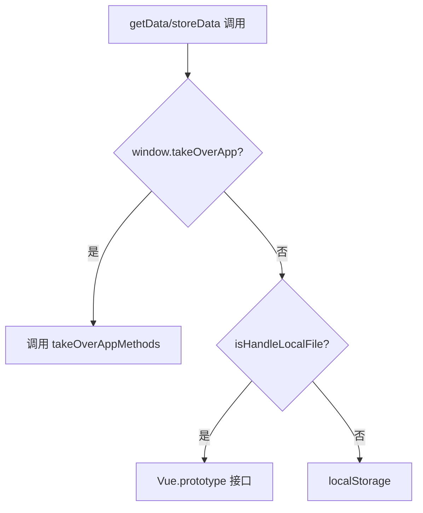
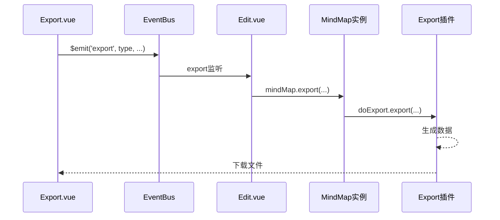
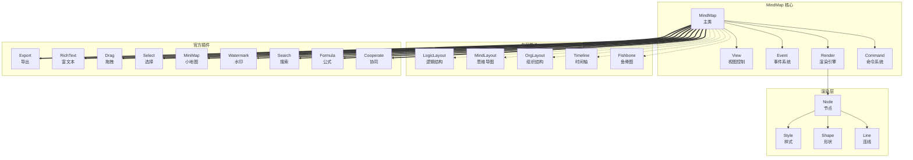
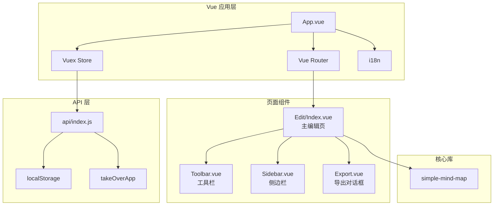
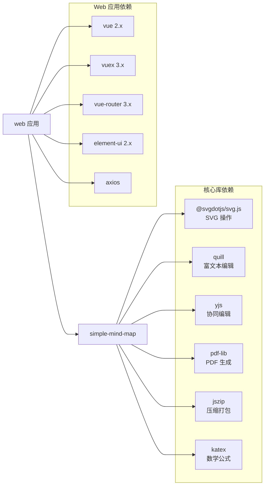

# Simple-Mind-Map 整体技术分析报告

版本: 1.0.0
更新时间: 2026-01-08 20:55:30

---

## 1. 项目概述

Simple-Mind-Map 是一个开源的 Web 思维导图库和应用，采用插件化架构设计，核心库不依赖任何框架，可快速集成到各类 Web 产品中。

### 1.1 仓库结构

```
mind-map/
├── simple-mind-map/    # 核心思维导图库（npm 包）
│   ├── src/
│   │   ├── core/       # 核心模块（command、event、render、view）
│   │   ├── layouts/    # 布局算法
│   │   ├── plugins/    # 官方插件
│   │   ├── theme/      # 主题系统
│   │   ├── parse/      # 格式解析
│   │   └── utils/      # 工具函数
│   ├── index.js        # 入口文件
│   └── full.js         # 完整版入口（包含所有插件）
├── web/                # Vue 2.x 演示应用
│   ├── src/
│   │   ├── pages/      # 页面组件
│   │   ├── store.js    # Vuex 状态管理
│   │   ├── api/        # 数据接口层
│   │   └── config/     # 配置文件
│   └── vue.config.js   # 构建配置
└── dist/               # 构建产物
```

---

## 2. 构建工具分析

### 2.1 Web 应用（web/）

| 项目 | 技术选型 |
|------|----------|
| 构建工具 | Vue CLI 4.5 + Webpack 4 |
| 预处理器 | Less |
| 代码规范 | ESLint + Prettier |
| UI 框架 | Element UI 2.x |

**关键配置**（`vue.config.js`）:
- 输出目录: `../dist`
- 支持运行时动态 publicPath（`webpack-dynamic-public-path`）
- 禁用 preload/prefetch 插件
- 需转译的依赖: `yjs`, `lib0`, `quill`

**构建命令**:
```bash
npm run serve    # 开发服务器
npm run build    # 生产构建
```

### 2.2 核心库（simple-mind-map/）

| 项目 | 技术选型 |
|------|----------|
| UMD 构建 | Vue CLI (--mode library) |
| ESM 构建 | esbuild |
| 类型定义 | TypeScript (仅生成 .d.ts) |

**构建命令**:
```bash
npm run buildLibrary  # 构建库文件
```

**输出产物**:
- `dist/simpleMindMap.umd.min.js` - UMD 格式（浏览器直接使用）
- `dist/simpleMindMap.esm.js` - ESM 格式（现代打包工具）
- `dist/simpleMindMap.esm.min.js` - ESM 压缩版

---

## 3. 状态管理分析

### 3.1 Vuex Store 结构

**文件路径**: `web/src/store.js`

```javascript
state: {
  isHandleLocalFile: false,    // 本地文件操作模式
  localConfig: {
    isZenMode: false,          // 禅模式
    openNodeRichText: true,    // 节点富文本
    useLeftKeySelectionRightKeyDrag: false,
    isShowScrollbar: false,
    isDark: false,             // 暗黑模式
    enableAi: true
  },
  activeSidebar: '',           // 当前侧边栏
  isOutlineEdit: false,        // 大纲编辑模式
  isReadonly: false,           // 只读模式
  isSourceCodeEdit: false,     // 源码编辑模式
  extraTextOnExport: '',       // 导出水印文字
  isDragOutlineTreeNode: false,
  aiConfig: {...},             // AI 配置
  extendThemeGroupList: [],    // 扩展主题
  bgList: []                   // 背景图片列表
}
```

### 3.2 Mutations

| Mutation | 功能 |
|----------|------|
| `setIsHandleLocalFile` | 设置本地文件操作标志 |
| `setLocalConfig` | 更新本地配置（自动持久化） |
| `setActiveSidebar` | 切换侧边栏 |
| `setIsOutlineEdit` | 切换大纲编辑模式 |
| `setIsReadonly` | 切换只读模式 |
| `setIsSourceCodeEdit` | 切换源码编辑模式 |
| `setExtraTextOnExport` | 设置导出水印 |

---

## 4. 数据持久化接口

### 4.1 API 层设计

**文件路径**: `web/src/api/index.js`

采用多模式数据存储策略：



### 4.2 存储键值

| 键名 | 用途 |
|------|------|
| `SIMPLE_MIND_MAP_DATA` | 思维导图节点数据 |
| `SIMPLE_MIND_MAP_CONFIG` | 思维导图配置 |
| `SIMPLE_MIND_MAP_LANG` | 界面语言 |
| `SIMPLE_MIND_MAP_LOCAL_CONFIG` | 本地个人配置 |

### 4.3 核心接口

```javascript
// 获取/存储思维导图数据
getData(): object
storeData(data: object): void

// 获取/存储配置
getConfig(): object
storeConfig(config: object): void

// 语言设置
getLang(): string
storeLang(lang: string): void

// 本地配置
getLocalConfig(): object
storeLocalConfig(config: object): void
```

### 4.4 接管模式（takeOverApp）

支持外部应用完全接管数据存储，需实现以下方法：

```javascript
window.takeOverAppMethods = {
  getMindMapData(),
  saveMindMapData(data),
  getMindMapConfig(),
  saveMindMapConfig(config),
  getLanguage(),
  saveLanguage(lang),
  getLocalConfig(),
  saveLocalConfig(config)
}
```

---

## 5. 导出系统分析

### 5.1 Export 插件

**文件路径**: `simple-mind-map/src/plugins/Export.js`

**支持格式**:

| 格式 | 方法 | 说明 |
|------|------|------|
| PNG | `png()` | 图片导出，支持透明背景 |
| JPG | `jpg()` | JPEG 格式导出 |
| SVG | `svg()` | 矢量图导出 |
| PDF | `pdf()` | PDF 文档导出 |
| JSON | `json()` | 纯数据导出 |
| SMM | `smm()` | 专有格式（JSON 别名） |
| Markdown | `md()` | Markdown 文档导出 |
| TXT | `txt()` | 纯文本导出 |
| XMind | `xmind()` | XMind 格式导出 |

### 5.2 导出流程



---

## 6. 模块依赖关系图

### 6.1 核心库架构



### 6.2 Web 应用架构



### 6.3 npm 依赖关系



---

## 7. 关键技术特性

### 7.1 插件化架构

```javascript
// 注册插件
MindMap.usePlugin(Export)
MindMap.usePlugin(RichText)

// 实例化时自动初始化所有已注册插件
const mindMap = new MindMap({ el, data })
```

### 7.2 事件系统

基于 `eventemitter3` 实现，支持：
- `on(event, fn)` - 监听事件
- `emit(event, ...args)` - 触发事件
- `off(event, fn)` - 解绑事件

### 7.3 命令系统

支持撤销/重做的命令模式实现。

### 7.4 主题系统

- 内置多套主题
- 支持自定义主题
- 运行时切换主题

---

## 8. 开发建议

### 8.1 二次开发入口

1. **仅使用核心库**: 直接引入 `simple-mind-map` npm 包
2. **基于 Web 应用**: fork `web/` 目录进行定制
3. **接管模式**: 通过 `takeOverApp` 集成到现有系统

### 8.2 扩展点

- 自定义插件
- 自定义主题
- 自定义节点形状
- 自定义布局算法

---

## 变更历史

| 版本 | 时间 | 变更内容 |
|------|------|----------|
| 1.0.0 | 2026-01-08 20:55:30 | 初始版本，完成源码审计 |
